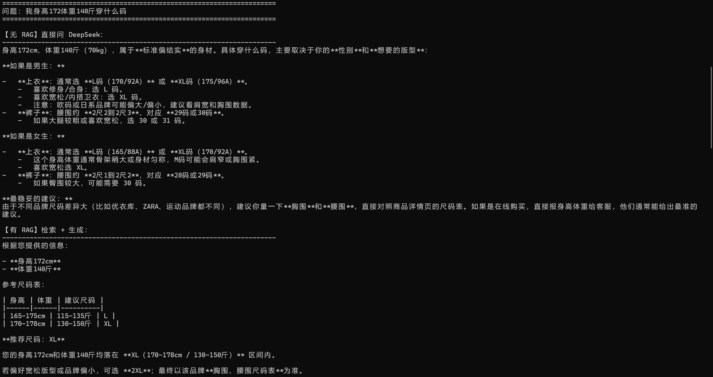

# 电商商品知识库 RAG 问答系统

基于 LangChain + Chroma 的电商商品咨询「检索增强生成（RAG）」问答系统，支持多轮对话与知识库在线更新，覆盖尺码、颜色、洗涤养护等高频咨询。

## 功能

- 使用 LCEL 搭建 RAG 链（检索 → 上下文组装 → Prompt → DeepSeek → 输出解析），支持流式输出
- 基于 Chroma 实现语义检索与文本切分（chunk 1000 / overlap 100），通过 MD5 指纹去重避免重复入库
- 自定义 `FileChatMessageHistory` 实现多会话历史持久化，结合 `RunnableWithMessageHistory` 支持多轮记忆
- 双应用架构：问答端 `app.qa.py` 流式对话、管理端 `app_file_uploader.py` 文件上传增量更新，无需改代码即可扩充知识
- 基于 Streamlit 的 Web 界面

## 目录结构

```
RAG项目/
├── app.qa.py                # 问答端入口：Streamlit 多轮对话，流式输出
├── app_file_uploader.py     # 管理端入口：上传 txt 文件，增量更新知识库
├── rag.py                   # 核心：LCEL RAG 链（检索→组装上下文→Prompt→DeepSeek）+ 多轮记忆
├── compare.py               # 对照实验：同一问题「无 RAG vs 有 RAG」对比输出
├── knowledge_base.py        # 知识入库：文本切分（chunk 1000/overlap 100）+ MD5 去重 + 写入 Chroma
├── vector_stores.py         # Chroma 向量库封装，get_retriever() 供 RAG 链检索
├── file_history_store.py    # 自定义文件聊天历史：按 session_id 持久化 JSON，支持多轮记忆
├── config_data.py           # 全局配置中心：模型/向量化/切分参数，从 .env 读密钥
├── requirements.txt         # 依赖清单（langchain / streamlit / chroma 等）
├── .env.example             # 密钥模板（DeepSeek + 阿里云百炼）
├── md5.text                 # 已入库文档的 MD5 去重指纹（gitignore）
├── data/                    # 知识库原始文档：尺码推荐.txt / 洗涤养护.txt / 颜色选择.txt
├── history/                 # 对话历史持久化目录（按 session_id 存 JSON，gitignore）
├── img/                     # 演示截图（无 RAG vs 有 RAG 对照）
└── chroma_db/               # Chroma 向量库持久化目录（gitignore）
```

## 调用流程

**问答链路（读）**

```
用户提问
  → app.qa.py（Streamlit 入口）
  → RAGService 链（rag.py）
       ├─ retriever 检索 Chroma（top-1）
       ├─ format_documents 拼装上下文
       └─ DeepSeek 生成回答（流式）
  → FileChatMessageHistory 把本轮消息写入 history/<session_id>
```

**入库链路（写）**

```
上传 txt
  → app_file_uploader.py（Streamlit 管理端）
  → KnowledgeBaseService（knowledge_base.py）
       ├─ get_string_md5 计算指纹 → check_md5 去重
       ├─ RecursiveCharacterTextSplitter 切分（chunk 1000 / overlap 100）
       └─ chroma.add_texts 写入向量库 + save_md5 记录指纹
```

## 无 RAG vs 有 RAG 对照

同一个问题，分别「裸问 DeepSeek」和「走 RAG 链」两条路径回答，直观对比检索增强的效果——无 RAG 只有通用常识，有 RAG 答案来自知识库、有据可依。运行 `python compare.py` 可复现。



## 技术栈

- Python
- LangChain —— LCEL、RunnableWithMessageHistory
- Chroma —— 向量数据库；阿里云百炼 text-embedding-v3 —— 文本向量化
- DeepSeek —— 对话模型
- Streamlit —— Web 界面

## 快速开始

### 1. 安装依赖

```bash
pip install -r requirements.txt
```

### 2. 配置 API Key

复制 `.env.example` 为 `.env`，填入 DeepSeek 与阿里云百炼密钥：

```bash
cp .env.example .env
```

### 3. 入库知识

运行管理端，上传 `data/` 目录下的 `.txt` 文件（或你自己的商品知识文档）：

```bash
streamlit run app_file_uploader.py
```

### 4. 启动问答

```bash
streamlit run app.qa.py
```

## 注意事项

- **密钥安全**：API Key 放在 `.env` 中，已加入 `.gitignore`，请勿提交到仓库。
- **首次使用**：需先在步骤 3 入库知识，问答端才能检索到内容。
- 对话历史默认持久化到 `history/`（已 gitignore）。
